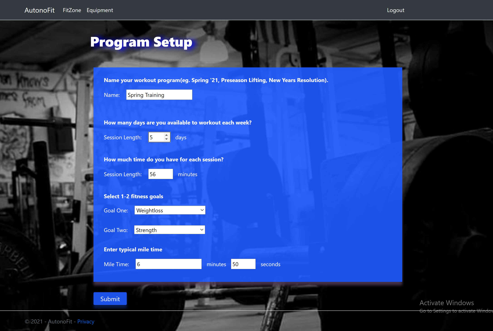
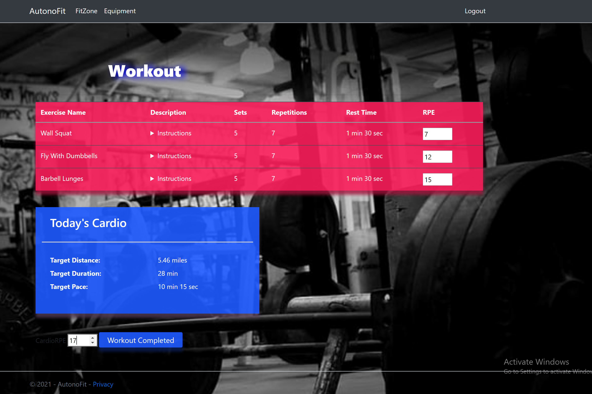

# **AutonoFit**
### **By Gregory Ryan**
### *For Kenzie Koch*
---
## **Overview**
Fitness/exercise web application that supplies users with convenient, yet appropriate automatically generated exercise routines. 

 

---

## **Functionality**

-Login or Register as a new user

-Choose to do a single workout, or progress through a program

-Input your time constraints so that your workout fits your schedule

-Select what equipment you have available, and incompatible exercises will be filtered out

-Exercise routines are populated from a database/REST API of over 400 exercises

-Choose to work upper body, lower body, both, or automatically alternate

-Select up to 2 fitness goals for a workout or program

-Parameters like sets, reps, and rest time are determined by selected fitness goals

-Use the RPE(rating of perceived exertion) scale of 6-20 to rate exercises

-Individual exercise parameters and cardio pace are progressed when improved fitness is reflected through decreasing RPE scores

-Programs with cardio workouts will rotate through easy, moderate, long runs, and speed training.

-Other considerations are taken into account to help prevent overuse injuries and overtraining.

---

## **Technologies used**

-Languages: C#, HTML(.cshtml), CSS, Javascript

-Text Editor: VS Community 2019

-Frameworks/Libraries: ASP .NET core, Twitter Boostrap 4

-APIs: wger.de's REST API for exercise and nutrition

---

## **Motivation Behind The Project**

The motivation to do this project was born out of the SARS-CoV-2 pandemic, as well as my girlfriend’s typical thoughts on going to the gym. Even before the threat of contracting covid, it was, and has been, a common complaint that going to the gym is an uncomfortable environment. From “gym-timidation” to shameful pickup attempts to contested equipment, there are more and more reasons being realized to work out from home. 

Alas, a whole other set of problems are encountered when you attempt to work out at home. You have to deal with limited equipment, limited space, and sifting through (often unreliable)fitness articles and YouTube fitness channels for advice.

That’s where AutonoFit comes in.  It is meant to be the solution to many of these problems. It is meant to accommodate your equipment limitations and the time constraints of your schedule, while still generating an appropriate workout or workout program similar to that which would be prescribed by a personal trainer or S&C coach. 

## **Limitations and Future Iterations**

### *Exercise Library*

One of the greatest limitations to this project is the exercise library it uses. This is not to say wger.de's site and API are not good for what they're designed for. It is rather to point out that it was a best-fit for my project, but not a great fit. 

While it would be quite an undertaking on its own, it would be ideal to have my own library of exercises which was curated by healthcare professionals dealing in health and wellness, such as myself. The classification system would also require additional properties, such as an exercise's purpose, type, or what goals it corresponds to.  

For instance, most stability exercises aren't going to be appropriate at 10 reps by 4 sets. But with the API used, there is no way to identify these differences without going through the > 400 exercises and identifying them individually.

As mentioned above, the library is not well-curated. It is such that the database is open to the public, and so ill-adviced activities and poor exercise descriptions make their way into the database.

### *Improving the algorithm*

As one could imagine, this endeavor to improve the exercise routine generative algorithm could potentially be a life-long pursuit. However, in the short term, what is needed most is a built-in consideration for the potential mismatch between a workout type and the entered time constraints --especially as it relates to cardio workouts.  

For instance, if the minimum workout duration of 20 minutes is selected for, and a person has goals involving cardio workouts, then rotating them through easy, moderate, long, and speed runs is pointless, as their long run will never exceed 20 minutes(though it should).  

A few possible solutions or combination of solutions come to mind:

1. The application could conceivably provide for more specificity in time constraints. Maybe one day, an individual has more time, and can go for the long run, but most days they cannot. A client will usually select their workout time based on what is most typical, or what is the lowest, limiting workout duration. So by allowing a client to select how much time they have on a Tuesday as opposed to a Friday could help solve the problem.  

2. Set different maximum and minimum work out durations that are dependent on the fitness goal being addressed. 

3. Eliminate run type rotation for those with the goal of weight loss, and maintain it for those with the goal of cardiovascular endurance, as it is more important and better suited for the latter goal.

### *This Project's Future*

This project was completed as a final capstone for the software development bootcamp, devCodeCamp. As it is such, there was never a pre-established expectation that this would be highly functional application, or more than the proof of a concept. 

In doing the project however, and in looking forward, it is not so hard to imagine how this project could be tweaked and polished to become the safe, reliable, and accommodating fitness application that was originally envisioned.  

I have a board of sticky notes nearby, each containing a new feature, or one of the aforementioned tweaks that would take this application to the next level. While the furthering of this project is not a high priority of mine currently, I certainly intend to continue working on it on a semi-consistent basis.  

